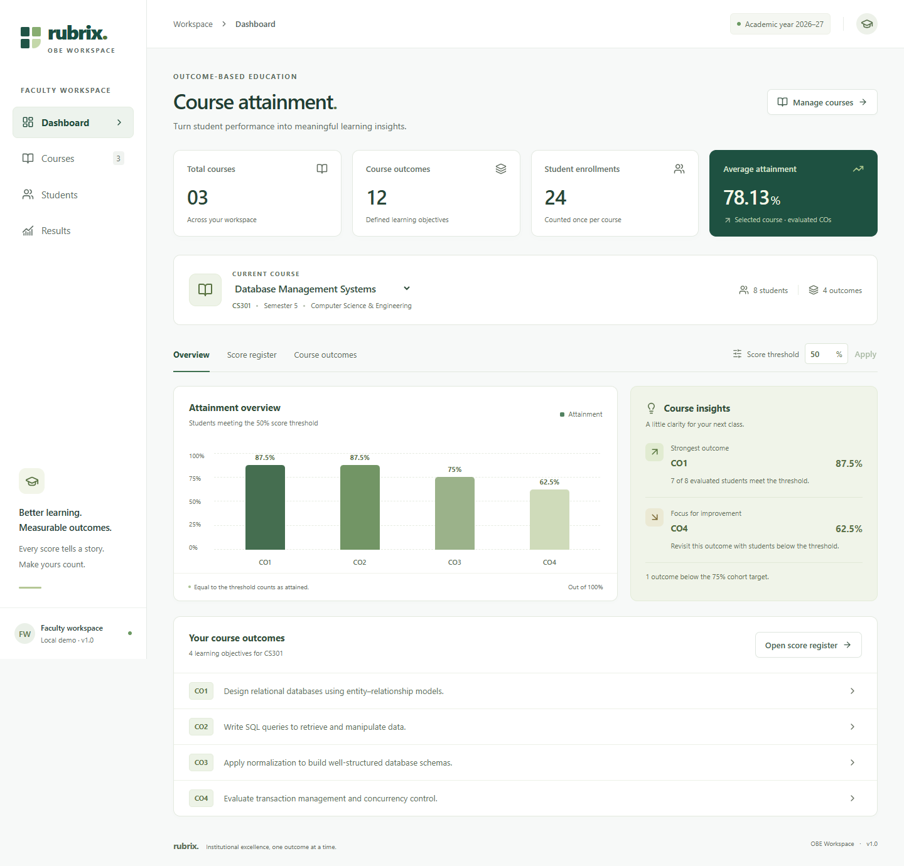

# Rubrix OBE

A small faculty workspace for defining course outcomes, entering student scores, and calculating attainment. Built for the Rubrix.ai technical assignment with FastAPI, SQLAlchemy, SQLite, Pydantic, pytest, React, TypeScript, Vite, and Tailwind CSS.

**Assignment reference: `RX-XXXX` — replace this placeholder with the exact code from your email before submitting.**



## Run locally

Requires Python 3.10+ and Node.js 22 LTS. Run the commands from the repository root. No database server or environment file is required.

Windows PowerShell, terminal 1:

```powershell
python -m venv .venv
.\.venv\Scripts\python.exe -m pip install --no-cache-dir -r backend\requirements.lock.txt
cd backend
..\.venv\Scripts\python.exe -m uvicorn app.main:app --reload --host 127.0.0.1 --port 8000
```

Windows PowerShell, terminal 2:

```powershell
cd frontend
npm ci
npm run dev
```

macOS/Linux, terminal 1:

```bash
python3 -m venv .venv
.venv/bin/python -m pip install -r backend/requirements.lock.txt
cd backend
../.venv/bin/python -m uvicorn app.main:app --reload --host 127.0.0.1 --port 8000
```

Start the frontend using the same `cd frontend`, `npm ci`, and `npm run dev` commands in a second terminal.

- Application: http://127.0.0.1:5173
- Interactive API documentation: http://127.0.0.1:8000/docs
- OpenAPI schema: http://127.0.0.1:8000/openapi.json

Stop each server with `Ctrl+C`. `npm run build` creates the production frontend in `frontend/dist`; serving that build also requires forwarding `/api` to FastAPI or setting `VITE_API_URL` before building.

### VS Code

Open this repository with `code .`. After installing dependencies, select **Run and Debug → Rubrix OBE: start app and browser** and press **F5**, or use **Terminal → Run Task → Start Rubrix**. The two servers run in separate VS Code terminals. Stop existing servers on ports 8000 and 5173 before starting another copy. A separate **Debug FastAPI** configuration is included. On macOS/Linux, select `.venv/bin/python` as the Python interpreter.

## What works

- Course, outcome, student, and score create/read/update/delete APIs with typed request and response models.
- Dashboard, course management, student search and sorting, and an editable score register.
- Batch score saves, inline validation, unsaved-edit protection, modal confirmations, and success/error notifications.
- Configurable score threshold, individual and course-wide attainment results, a chart, progress bars, and client-side CSV export.
- Responsive navigation and horizontally scrollable score tables, keyboard focus states, and native modal focus handling.
- Three seeded courses, four outcomes per course, and eight student enrollments per course. The same eight demo names appear in each course: the dashboard correctly labels the total as **24 enrollments**, not 24 unique people.

## Calculation and assumptions

```text
attainment (%) = count(recorded scores >= threshold) / count(recorded scores) × 100
```

`backend/app/services/attainment.py` contains the pure calculation function. Routes retrieve the scores and call it; the function has no HTTP or database dependencies.

- Scores and thresholds are percentages between 0 and 100, inclusive. Scores exactly equal to the threshold count using `>=`.
- For `[49.99, 50, 100]` at threshold `50`, two of three students attain: **66.67%**.
- Missing scores are excluded from the denominator. A recorded zero is included. Clearing a score cell deletes that score; it does not save zero.
- Empty data returns zero evaluated, zero attained, and 0% without division by zero. The UI displays **No scores / —** to distinguish this from an evaluated 0%.
- Results are rounded to two decimal places. The dashboard average is an unweighted mean of evaluated outcome percentages for the selected course.
- Status bands are Excellent ≥80%, Good ≥60% and <80%, and Needs attention <60%. Insights compare cohort attainment against a fixed 75% teaching benchmark. This is distinct from the adjustable score threshold used to evaluate individual students.
- A Student is a course enrollment. Its roll number is unique within that course. This deliberately small model avoids a separate institution-wide student registry.

## Architecture

```text
React views → typed fetch client → FastAPI routers → SQLAlchemy → SQLite
                                      ↓
                              attainment service
```

| Location | Responsibility |
| --- | --- |
| `backend/app/models.py` | Four relational entities, uniqueness constraints, score range check, cascading foreign keys |
| `backend/app/schemas.py` | Pydantic validation and response contracts |
| `backend/app/database.py` | Engine setup, SQLite foreign keys, request-scoped sessions |
| `backend/app/routers/` | Nested CRUD APIs, relationship validation, transaction boundaries |
| `backend/app/services/attainment.py` | Inclusive-threshold calculation |
| `backend/app/seed.py` | Deterministic, idempotent demo seed |
| `frontend/src/components/` | Reusable navigation, forms, chart, score table, dialog and feedback UI |
| `frontend/src/pages/` | Course, student and results views |
| `frontend/src/hooks/useWorkspace.ts` | Course selection, data loading, stale-response protection |
| `frontend/src/services/api.ts` | Configurable fetch client and API error handling |

A Course has many CourseOutcomes and Students. Each Score references one Student and one CourseOutcome, with a unique `(student_id, co_id)` pair. API writes reject cross-course relationships. SQLite foreign keys are enabled explicitly; deleting a course, outcome, or student removes its dependent scores. A batch score save validates every relationship first and commits all edits in one transaction.

The API uses 201 for creation, 204 for deletion, 404 for missing or out-of-course records, 409 for uniqueness conflicts, and 422 for invalid input. Updates use `PUT` with complete entity input. The score update body only needs `value`.

## Key endpoints

| Method | Path | Purpose |
| --- | --- | --- |
| GET / POST | `/api/courses` | List or create courses; optional `search` on GET |
| GET / PUT / DELETE | `/api/courses/{id}` | Course detail, edit or delete |
| GET / POST | `/api/courses/{id}/cos` | Outcomes |
| GET / PUT / DELETE | `/api/courses/{id}/cos/{co_id}` | One outcome |
| GET / POST | `/api/courses/{id}/students` | Enrollments; optional `search` on GET |
| GET / PUT / DELETE | `/api/courses/{id}/students/{student_id}` | One student |
| GET / POST / PUT | `/api/courses/{id}/scores` | Read, create or batch upsert scores |
| GET / PUT / DELETE | `/api/courses/{id}/scores/{score_id}` | One score |
| GET | `/api/courses/{id}/cos/{co_id}/attainment?threshold=50` | One CO calculation |
| GET | `/api/courses/{id}/attainment?threshold=50` | All CO calculations |

Batch `PUT` accepts `{"scores":[{"student_id":1,"co_id":1,"value":50}]}`. A `null` value clears a cell. Duplicate pairs within a request are rejected.

## Seed and configuration

The first backend startup creates `backend/data/rubrix.db` and seeds the three demo courses. Later restarts preserve edits and deletions, including an intentionally empty workspace. The seed runs automatically only when the course table is first created.

To explicitly seed an empty database from `backend/`:

```powershell
..\.venv\Scripts\python.exe -m app.seed
```

The command leaves a nonempty course database unchanged. Use `../.venv/bin/python` on macOS/Linux. To start without demos, copy `backend/.env.example` to `backend/.env` and set `AUTO_SEED=false` before first startup. An optional `DATABASE_URL` overrides the default SQLite location; create its parent folder first. The default database path is independent of the terminal working directory.

Frontend settings in `frontend/.env.example` document `VITE_API_URL` and `API_PROXY_TARGET`. The default Vite proxy connects `/api` to `http://127.0.0.1:8000`. Backend `CORS_ORIGINS` is a JSON array of allowed browser origins. No credentials are required or included.

## Verification

From `backend/`:

```powershell
..\.venv\Scripts\python.exe -m pytest -q
```

From `frontend/`, with both servers running:

```powershell
npm run build
npm run test:e2e
```

The browser tests use installed Google Chrome. If Chrome is unavailable, run `npx playwright install chromium` and remove `channel: 'chrome'` from `playwright.config.ts`. They create and clean up a temporary course; they do not modify the seeded courses.

Verified during implementation: **21 pytest tests pass**, production TypeScript/Vite build passes, and **3 Playwright browser tests pass**. Browser checks cover seeded data, score validation, every entity’s create/edit/delete flow, exact-threshold attainment, persistence after reload, clearing scores, threshold updates, CSV download, mobile overflow, and a rendered Swagger UI. Two upstream Starlette deprecation warnings are present in pytest; there are no failing tests.

Python versions are captured in `requirements.lock.txt`; `requirements.txt` records the supported direct dependency ranges. `package-lock.json` pins the frontend dependency graph. The frontend uses the official `esbuild-wasm` package through an npm alias because the native esbuild binary could not enumerate parent directories in the development Windows sandbox; Vite, React, and Tailwind remain unchanged.

## Scope and next steps

The core assignment is complete locally. **GitHub publication is pending: the available browser requires sign-in and no destination repository was supplied.** The RX reference remains a visible placeholder. Source code contains no comments, as requested. The app ran successfully in local development servers; this environment blocked the VS Code renderer from launching, so the included VS Code task configuration could not be exercised inside the editor.

After creating an empty GitHub repository, publish the local commit history from the repository root:

```bash
git remote add origin YOUR_GITHUB_REPOSITORY_URL
git push -u origin main
```

Intentionally deferred: authentication/JWT and faculty ownership, Docker Compose, schema migrations, pagination, CSV import, audit history, concurrent-edit detection, and institution-wide student records. This is a local assignment app with no authentication; it is not configured for a public multi-user deployment. With more time I would add faculty ownership enforced server-side, Alembic migrations, then optimistic concurrency and broader accessibility testing.

For an interview walkthrough: start with the pure calculation and its boundary test, explain missing versus zero scores, follow one batch save from React to its database transaction, and finish with the deliberate per-course enrollment model and deferred authentication.
